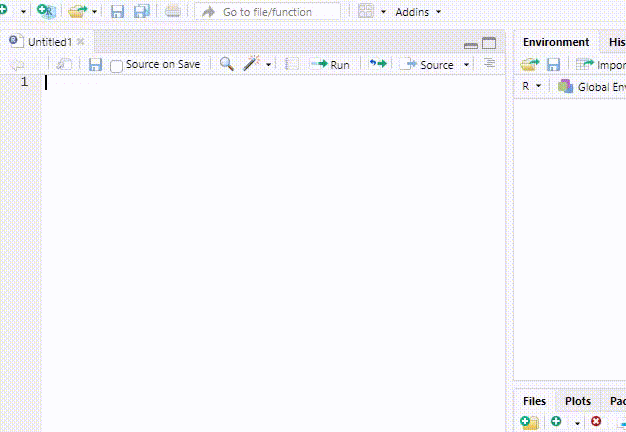
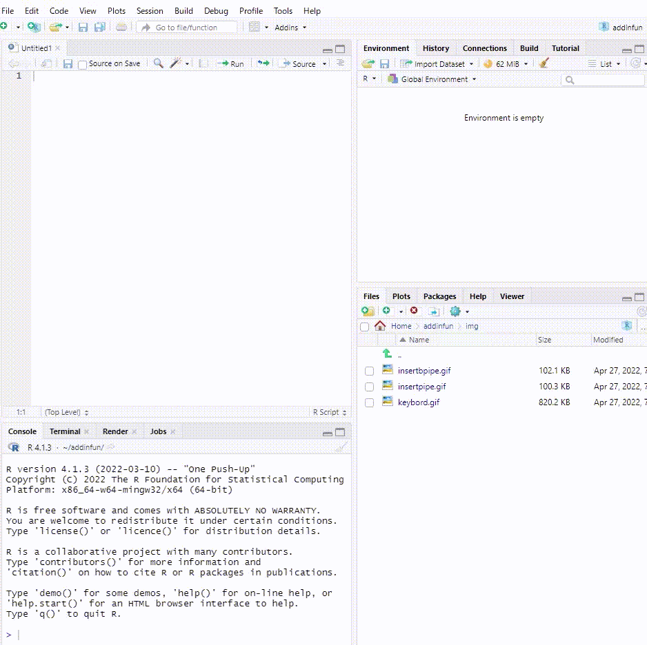

<!-- README.md is generated from README.Rmd. Please edit that file -->

```{r, include = FALSE}
knitr::opts_chunk$set(
  collapse = TRUE,
  comment = "#>",
  fig.path = "man/figures/README-",
  out.width = "100%"
)
```

# addinfun

`{addinfun}` is a collection of Addins for Rstudio for me, but maybe also you.

Functions may be added, specifications of functions may change or become obsolete, and names may change without notice.

Currently, `{addinfun}` provide add-ins for the insert function of each pipe operation for `{base}` and `{magrittr}`, and by registering one of these as a keyboard shortcut, the add-ins provide the ability to insert two pipe operations with keyboard shortcuts, along with the keyboard shortcut for the pipe operation set up in RStudio.

## Installation

You can install the development version of addinfun from GitHub like so:

``` r
install.packages("remotes")
remotes::install_github("indenkun/addinfun")
```

## Example

Once installed, the add-in for inserting pipe operations is registered in RStudio's Addins.

Example: For an add-in that inserts a `{magrittr}` pipe operation.



Example: For an add-in that inserts a `{base }` pipe operation.


These add-ins can be configured with keyboard shortcuts in the add-in settings of Tools in RStudio.



This means that if the insert function in the keyboard shortcut of the pipe operation set on the RStudio side is set as the `{base}` pipe operation, then by setting the insert of the `{magrittr}` pipe operation in the add-in, it is possible to set the keyboard shortcut of two pipe operations keyboard shortcuts can be set up.

The reverse is also true.

However, if there are changes in the minor version or higher of R that differ from when it was installed, the add-in may not be reflected in that case.

## License

MIT.

## Notice

* The email address listed in the DESCRIPTION is a dummy. If you have any questions, please post them on ISSUE.
